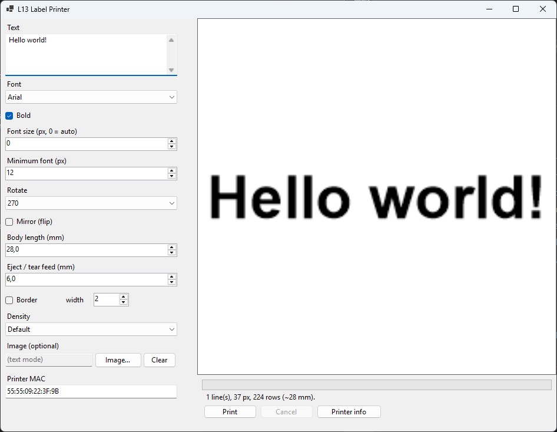
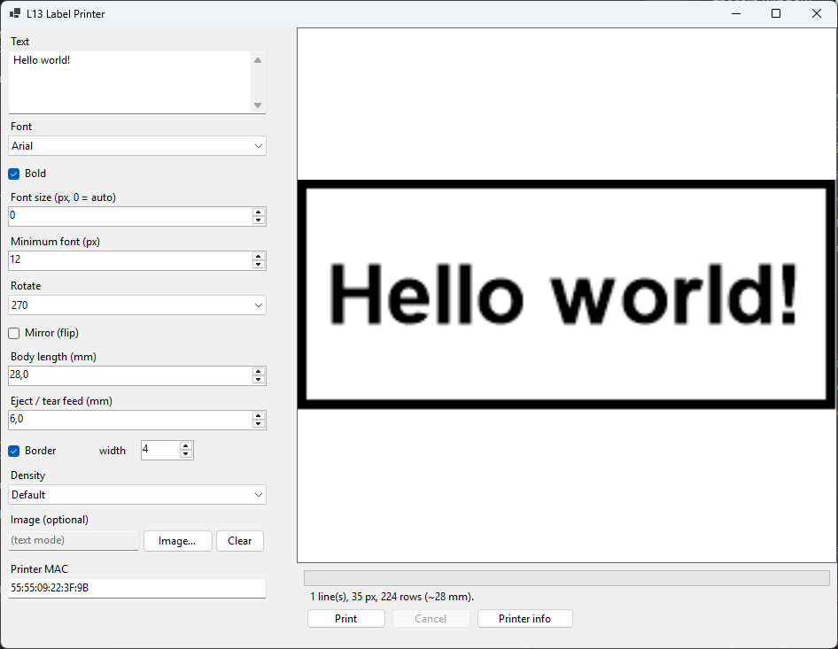
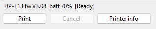
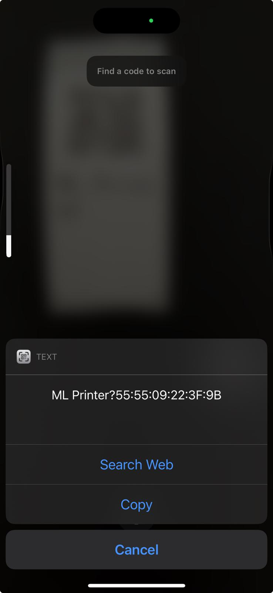
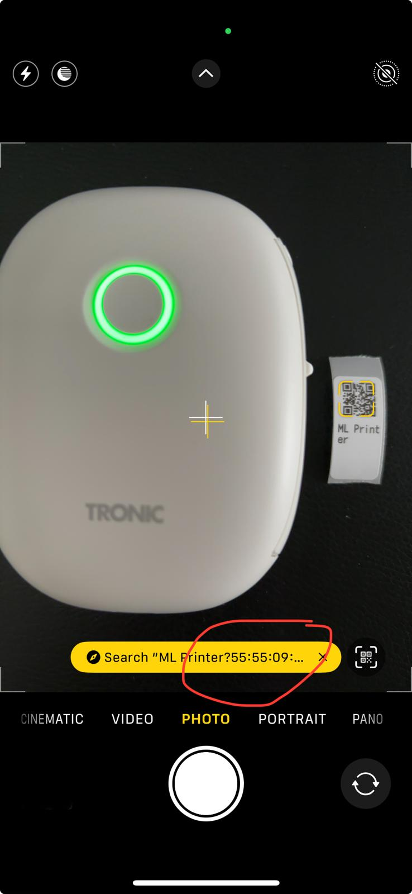

# L13 Label Printer

A small Windows desktop app for the **Luck Jingle L13 / DP-L13** mini label maker
(sold under many names — AiYin L13, SilverCrest 5890, Tronic 6326, "Fichero" / "Pocket Printer"
egg printer) with firmware V3.08. It talks to the printer directly over **Classic Bluetooth (RFCOMM)**
— no vendor app required — renders text or an image to the printer's 96‑dot head,
and prints it with a live preview and progress bar.

It grew out of a reverse‑engineering session — the full protocol write‑up is in
[`docs/PROTOCOL.md`](docs/PROTOCOL.md). In great parts vibe-coded using Opus 4.8 (Extra).

## Screenshots

| Main window | Border / edge test | Printer info |
|---|---|---|
|  |  |  |

## Features

- **Live preview** — WYSIWYG, showing the label as it prints (held with the edge that exits first on the right).
- **Auto‑fit typography** — largest font that fits, never below 12 px; text that won't fit on one line wraps to two.
- **Centering** — horizontal and vertical, on the printable label body.
- **Border test** — draw a rectangle around the whole printable area to check edge coverage.
- **Image / logo mode** — scaled, centered and thresholded to 1‑bit.
- **Background printing** — responsive UI with a progress bar and cancel.
- **Printer info** — model, firmware, serial, battery and status.

## Requirements

- Windows 10/11
- [.NET 10 SDK](https://dotnet.microsoft.com/download) (to build) or the .NET 10 Desktop Runtime (to run a published build)
- Visual Studio 2026 (optional — the solution uses the `.slnx` format)
- A Bluetooth adapter (the app connects directly — no manual Windows pairing needed)

## Build & run

```powershell
cd L13Printer
dotnet build
dotnet run --project src/L13.App
```

Or open `L13Printer.slnx` in Visual Studio 2026 and run **L13.App**.

## Finding your printer's MAC address

The app needs the printer's Bluetooth MAC (e.g. `55:55:09:22:3F:9B`). Enter it in
the **Printer MAC** field; both `55:55:09:22:3F:9B` and `555509223F9B` are accepted.

You do **not** need to pair the printer in Windows first. The app opens its own
RFCOMM connection and Windows pairs the device automatically on the first
connection (accept the pairing prompt if one appears) — the same way the vendor
app connects. Just supply the MAC.

Get the MAC with any of these:

### A. Scan the printer's QR code (no pairing needed)

Press the printer's button **twice**: it prints a small label with a QR code that
holds its pairing info — this is how the official app discovers it. Point your
phone's camera / any QR scanner at it; the decoded text contains the MAC (look for
the `55:55:09:22:3F:9B`‑style value). Type that into the app.




### B. Windows PowerShell (if the printer is already paired)

```powershell
Get-PnpDevice -Class Bluetooth |
  Where-Object FriendlyName -eq 'ML Printer' |
  ForEach-Object { ($_ | Get-PnpDeviceProperty -KeyName 'DEVPKEY_Bluetooth_DeviceAddress').Data }
```

This prints the 12 hex digits, e.g. `555509223f9b`. Add colons if you like.

### C. Device Manager (if the printer is already paired)

_Device Manager → Bluetooth → right‑click **ML Printer** → Properties → Details tab →
Property: **Bluetooth device address**._

> The channel is fixed at RFCOMM **1** for this model; you shouldn't need to change it.

## Usage

1. Enter your printer's MAC and click **Printer info** to confirm the connection. On the very first connection Windows may show a pairing prompt — accept it.
2. Type your text (or pick an image), adjust font / rotation / length as needed.
3. Watch the preview; when it looks right, click **Print**.

Notes on the label geometry:

- The head is **96 dots (~12 mm)** wide, which sits ~1 mm inside each edge of a 14 mm label — this is fixed hardware.
- **Body length** defaults to 28 mm (the printable body; 30 mm labels count the inter‑label gap in the pitch).
- After printing, the firmware **seeks to the next label border** (IR gap sensor); an **eject** feed (default 6 mm) advances it to the tear edge.

## How it works

The printer speaks a mostly proprietary command set with an ESC/POS‑style raster
command (`GS v 0`). The essentials:

- Enable `10 FF F1 03`, send raster bands `1D 76 30 00 …` (≤ 24 rows each), stop `10 FF F1 45`
- Seek to the next label border with a bare form feed `0C`; fine‑feed with `1B 4A nn`
- Status/info via `10 FF 40`, `10 FF 20 F0/F1/F2`, `10 FF 50 F1`

The full reverse‑engineering write‑up (gap detection, parameter decoding, geometry,
orientation derivation) is in [`docs/PROTOCOL.md`](docs/PROTOCOL.md).

## Project structure

```
L13Printer.slnx
└─ src/
   ├─ L13.Core/          UI-agnostic engine (no WinForms dependency)
   │   ├─ Bluetooth/     RfcommClient · NativeMethods (Ws2_32) · BluetoothAddress
   │   ├─ Rendering/     LabelRenderer · RasterPacker · RenderOptions/Result
   │   └─ Printing/      L13LabelPrinter · PrintOptions · PrinterStatus/DeviceInfo
   └─ L13.App/           WinForms front end (MainForm, Program)
```

`L13.Core` has no UI dependency, so the same engine can back the GUI or a future
CLI. It uses the Windows Desktop framework only for GDI+ (`System.Drawing`).

## Acknowledgements

Reverse‑engineering of this printer family builds on prior work by:

- **atctwo** — [Reverse Engineering a Thermal Label Printer](https://atctwo.net/posts/2024/07/16/thermal-printer.html) (the same DP‑L13)
- **0xMH** — [fichero-printer](https://github.com/0xMH/fichero-printer) protocol notes

## Disclaimer

Not affiliated with the manufacturer. Use at your own risk. "Bluetooth" and any
product names are trademarks of their respective owners.

## License

Released into the public domain under **[The Unlicense](LICENSE)** — do whatever
you like with it.
